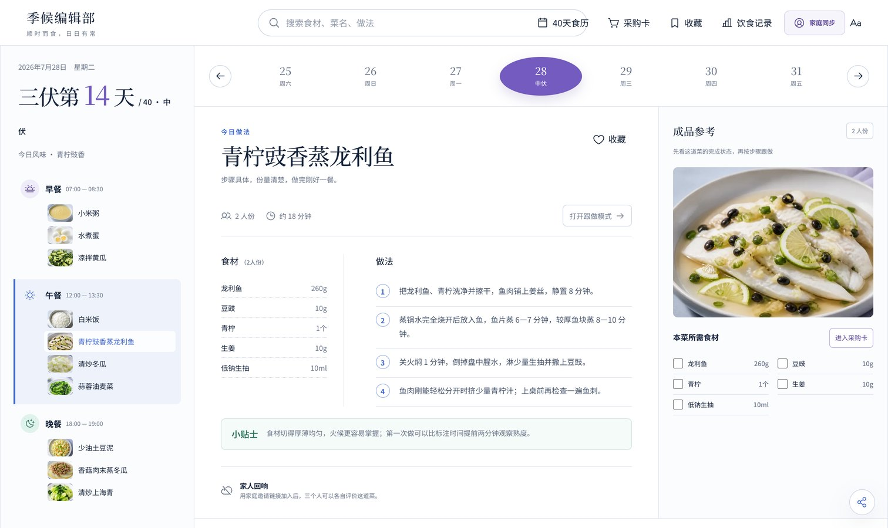
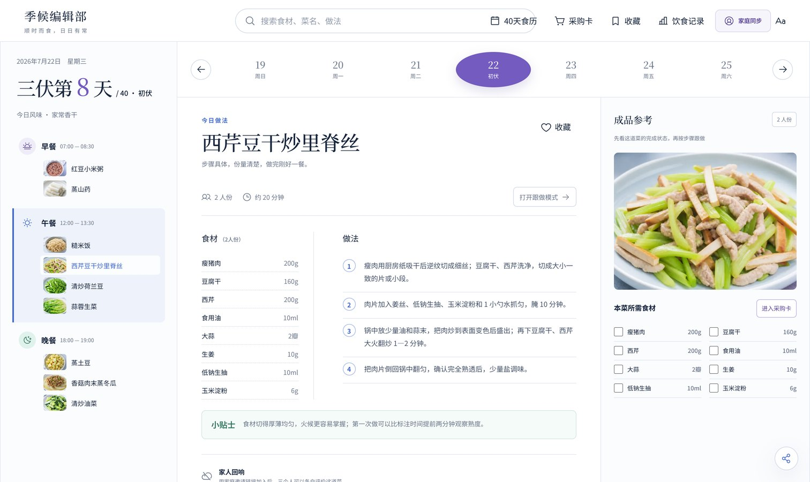
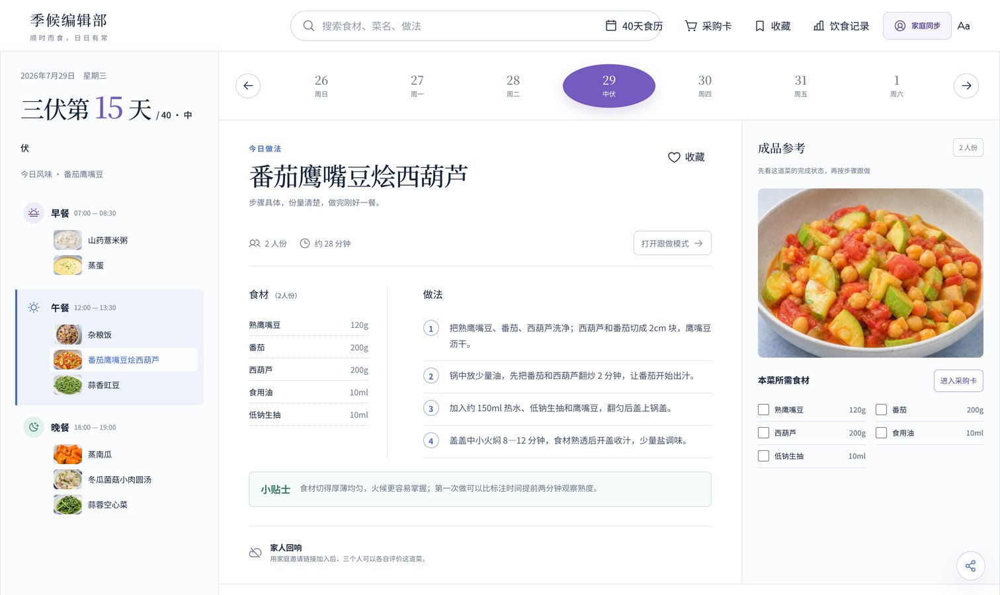
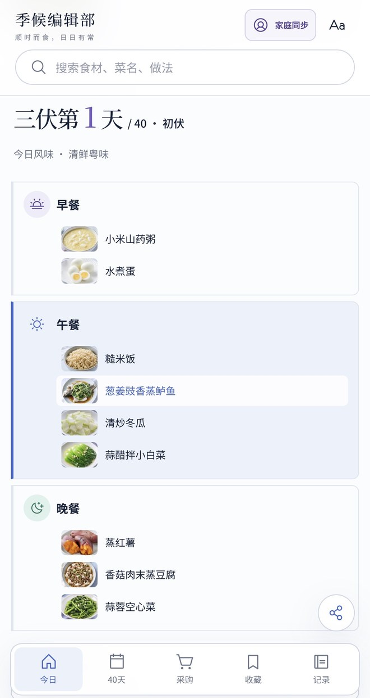

<div align="center">

# 🌾 seasonal-meal-calendar · 季候编辑部

**顺时而食，日日有常。**

一个开源 Agent Skill：告诉 AI「给家里做个三伏 40 天的食谱」，它会生成一份经过校验的菜单数据，再一键出一个手机上就能用的食谱网页。



<sub>作者给家里做的「三伏四十日食历」电脑版截图，每道菜配了 AI 生成的成品图。</sub>

</div>

---

## ✨ 做出来的网页有什么

- **今日三餐**：打开就是今天吃什么，日期、节气阶段、第几天一目了然
- **日期条**：前后翻天；开始日期可以在页面里改，日历自动顺延
- **做法详情**：每道菜有自己的食材克数和步骤，写清火候、时长和熟度判断
- **跟做模式**：一步一屏，大字，适合边做边看
- **采购卡**：自动汇总接下来 1 / 3 / 7 天要买的食材，可以勾选；盐油这类常备调料不列入
- **收藏、饮食记录、搜索**：吃完点一下自动记时间
- **舒展字号**：一键放大，长辈看着不费劲
- **离线单文件**：一个 `index.html`，不依赖服务器；收藏和记录只存在各自手机上

## 📱 实际效果

**电脑版**：左边当天三餐，中间做法，右边成品参考和采购勾选。




**手机版**：

<table>
<tr>
<td align="center"><br><sub>今日三餐</sub></td>
<td align="center"><br><sub>四十日食历</sub></td>
<td align="center"><br><sub>饮食记录</sub></td>
</tr>
</table>

<sub>说明：截图里的「家庭同步」和「冰箱库存」需要服务器，本 skill 生成的离线版不含这两项；成品图需要另配图像模型生成（可以配合 recipe-video-cards）。</sub>

## 🧠 AI 会怎么做

```text
问清约束 → 分阶段排日历 → 先写菜谱库再排三餐 → validate_plan.py 校验 → build_site.py 出网页 → 浏览器实测
```

校验脚本会拦下这些问题：

| 检查 | 说明 |
|---|---|
| 忌口零命中 | 菜名、食材、步骤、贴士里都不能出现，写「香菜替代」也算命中 |
| 结构完整 | 天数、三餐、菜品引用、阶段覆盖都要对得上 |
| 不重复 | 整套菜单不重复，主菜不连续两天出现 |
| 步骤能照做 | 做菜步骤要有时长、火候或熟度判断，不接受「炒熟即可」 |
| 热量范围 | 每日估算偏离常见范围会提醒复核 |

## 📦 安装

```bash
# Claude Code（个人级）
git clone https://github.com/mirandakaro/seasonal-meal-calendar.git ~/.claude/skills/seasonal-meal-calendar

# Hermes Agent
git clone https://github.com/mirandakaro/seasonal-meal-calendar.git ~/.hermes/skills/seasonal-meal-calendar
```

其他支持 Agent Skills 的助手，把整个文件夹放进它的 skills 目录即可。不支持的话，把 `SKILL.md` 当作项目规则导入。

需要 Python 3.9+，只用标准库，不用装依赖。

## 🚀 用法

对 AI 说：

> 用 seasonal-meal-calendar 给我做一个立秋 14 天的家常食谱，3 个人吃，不吃香菜，少油少辣。

也可以自己手动跑示例：

```bash
python3 scripts/validate_plan.py examples/liqiu-3days/plan.json
python3 scripts/build_site.py   examples/liqiu-3days/plan.json
open examples/liqiu-3days/site/index.html
```

## 📁 目录

```text
seasonal-meal-calendar/
├── SKILL.md                    # 技能入口
├── templates/
│   ├── plan.schema.json        # 数据格式
│   └── app.html                # 网页模板
├── scripts/
│   ├── validate_plan.py        # 校验
│   └── build_site.py           # 生成网页
├── references/quality-gates.md # 完整质检清单
├── examples/liqiu-3days/       # 虚构 3 天示例 + 生成好的网页
└── evals/evals.json            # Agent 行为测试题
```

## 🤝 相关项目

- [recipe-video-cards](https://github.com/mirandakaro/recipe-video-cards)：把做饭视频变成图解食谱卡，可以给这里的菜配成品图。

## ⚠️ 使用须知

- 热量是按菜谱用量估算的，不含水果、奶类和加餐。
- 这是家常搭配，不是医疗处方。有慢性病、特殊用药或饮食限制，请听医生或营养师的。

## License

[MIT](LICENSE)

---

<a id="english"></a>

**English** — An open-source agent skill that turns "make a 40-day seasonal meal plan for my family" into a validated `plan.json` and a single-file, offline, mobile-first web page: today's meals, a date strip with editable start date, per-dish recipes with timings and doneness cues, a cook-along mode, a 1/3/7-day shopping list, favorites, a meal log and a large-text mode. `validate_plan.py` enforces zero exclusion hits, no repeated menus or back-to-back mains, and actionable steps. Python standard library only. MIT licensed.
